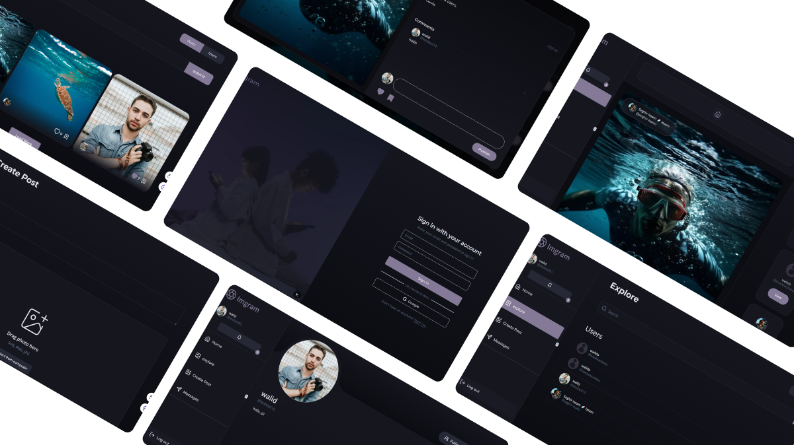

<h1 align="center">
  
  Imgram
 
</h1>

 
 
 

 

**Imgram |** comprehensive social networking site built using Next.js and Express. It allows users to create posts, follow others, and engage with content through likes, comments, and saves. The application is fully responsive and optimized for performance and SEO, with real-time notifications.

  <a href="https://imgramapp.vercel.app/" target="_blank">View Demo.</a>

## Built With
#### front End

    

     

### Backend End

   

 

## features
- 🔒**Authentication:** Secure user authentication with Clerk, supporting credentials and Google OAuth.

- 👥 **Profile Management:** Users can update their profiles, including avatars and bio.

- 🗞 **Post Creation:** Users can create, update, and delete posts with images and text.

- 🌍 **Engagement**: Like, save, and comment on posts, follow users, and accept follow requests.

- ⏳ **Real-Time Updates**: Real-time notifications for interactions such as likes, comments, and follows via WebSockets.

- 🎊 **Responsive Design:** Adaptive design ensures a great experience on desktops, tablets, and mobile devices.

- 🚀 **High Performance**: Optimized for quick loading times and responsive interactions
